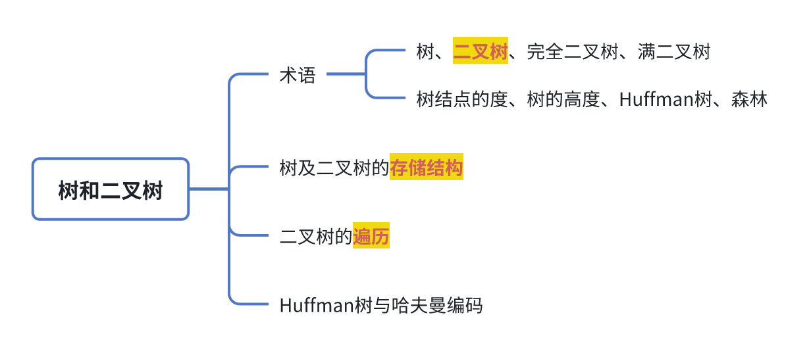
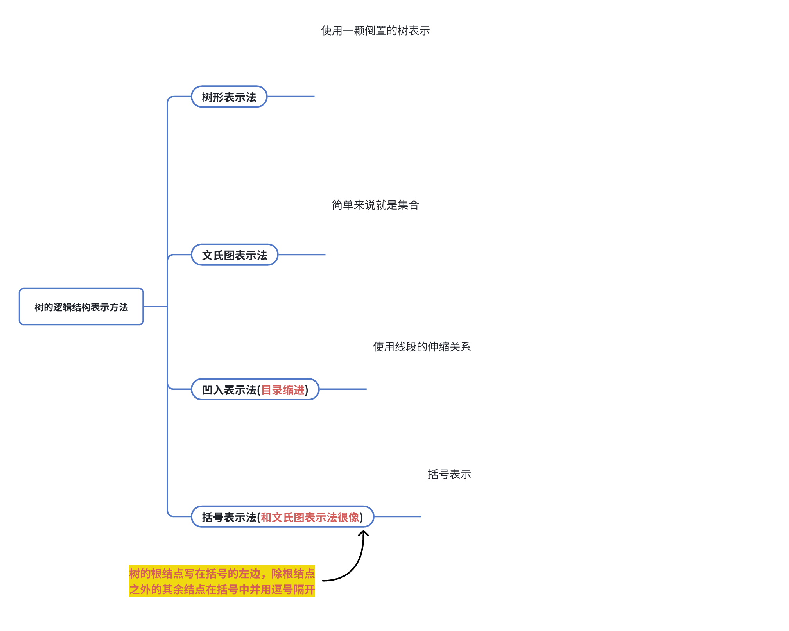

# 7.1树

## 7.1.1树的定义

> ### 核心思想总结
>
> 你可以永远记住这个最核心的比喻：
>
> 树 ≈ 家族族谱
>
> * 结点 = 家庭成员
>
> * 根结点 = 始祖（最老的祖宗）
>
> * 后继/孩子结点 = 儿子、女儿
>
> * 前驱/双亲结点 = 爸爸
>
> * 叶子结点 = 没有后代的家庭成员
>
> * 层次 = 辈分

## 7.1.2树的逻辑结构表示方法

## 7.1.3树的基本术语

## 7.1.4树的性质

# 7.2二叉树

# 7.3二叉树先序、中序、后序遍历

# 7.4二叉树的层次遍历

# 7.5二叉树的构造

# 7.7哈夫曼树

# 7.8二叉树与树、森林之间的转换

