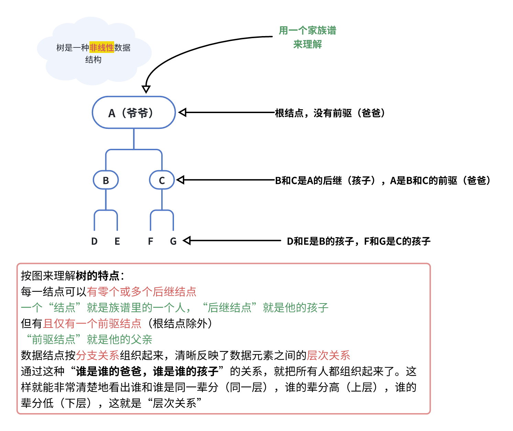
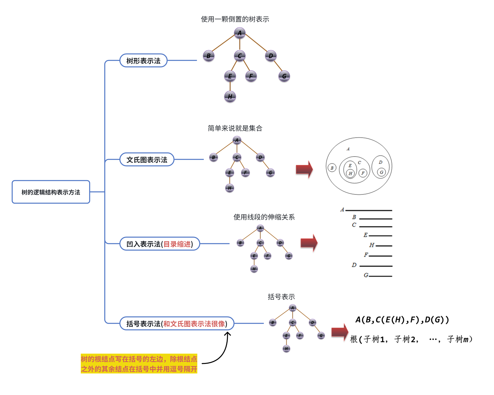
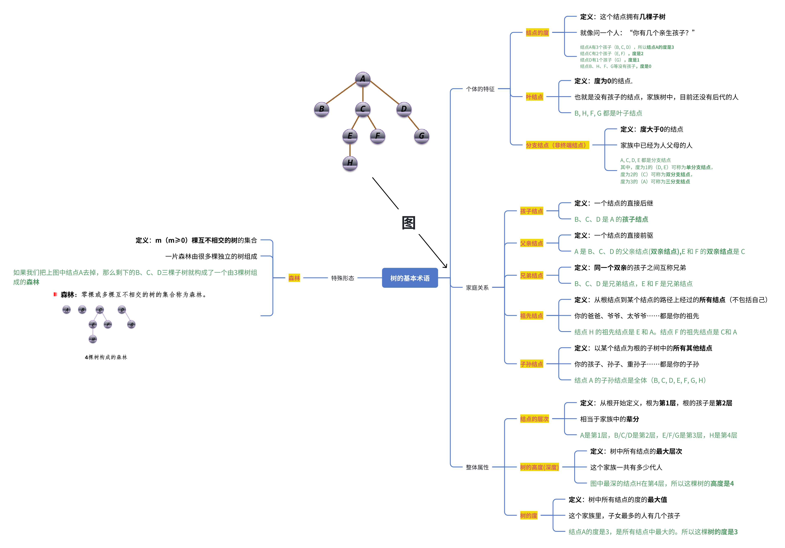
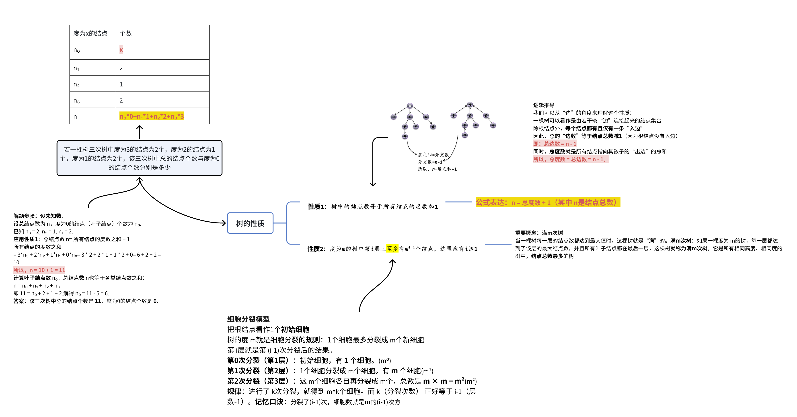

# 7.1树

## 7.1.1树的定义

> ### 核心思想总结
>
> 你可以永远记住这个最核心的比喻：
>
> 树 ≈ 家族族谱
>
> * 结点 = 家庭成员
>
> * 根结点 = 始祖（最老的祖宗）
>
> * 后继/孩子结点 = 儿子、女儿
>
> * 前驱/双亲结点 = 爸爸
>
> * 叶子结点 = 没有后代的家庭成员
>
> * 层次 = 辈分

## 7.1.2树的逻辑结构表示方法

## 7.1.3树的基本术语

**结点的度 VS 树的度**

> 结点度，看自己；树度，看全班（找最大）

## 7.1.4树的性质

## 7.1.5树的基本运算

1. 查找满足某种特定关系的结点，如寻找当前结点的双亲结点等；

2. 插入或删除某个结点，如在树的当前结点上插入一个新结点或删除当前结点的第*i*个孩子结点等；

3. 遍历树中每个结点。

## 7.1.6树的存储结构

> 双亲存，找爹易；孩子链，寻儿快。二者优缺点正相反，根据需求做选择

